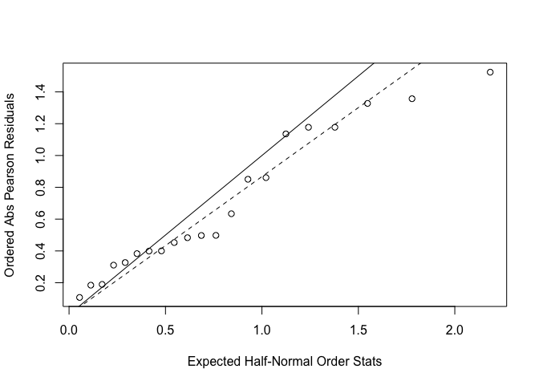

p8131\_hw3\_xy2395
================
Jack Yan
2/19/2019

#### Problem 1

##### Data entry

Manually import the data.

``` r
case <- tibble(
  age = c(25, 35, 45, 55, 65, 75),
  non_exposed = c(0, 5, 21, 34, 36, 8),
  exposed = c(1, 4, 25, 42, 19, 5)
) %>% 
  mutate(disease = 'diseased')

control <- tibble(
  age = c(25, 35, 45, 55, 65, 75),
  non_exposed = c(106, 164, 138, 139, 88, 31),
  exposed = c(9, 26, 29, 27, 18, 0)
) %>% 
  mutate(disease = 'non_diseased')
```

##### Data manipulation

Make the data suitable for prospective modeling.

``` r
data_p1 = 
  rbind(case, control) %>%
  gather(key = 'exposure_status', value = 'number', non_exposed:exposed) %>% 
  mutate(exposure_status = recode(exposure_status, non_exposed = '0', exposed = '1')) %>% 
  mutate(exposure_status = as.factor(exposure_status)) %>% 
  spread(key = disease, value = number)  %>% 
  select(diseased, non_diseased, exposure_status, age)

data_p1
```

    ## # A tibble: 12 x 4
    ##    diseased non_diseased exposure_status   age
    ##       <dbl>        <dbl> <fct>           <dbl>
    ##  1        0          106 0                  25
    ##  2        1            9 1                  25
    ##  3        5          164 0                  35
    ##  4        4           26 1                  35
    ##  5       21          138 0                  45
    ##  6       25           29 1                  45
    ##  7       34          139 0                  55
    ##  8       42           27 1                  55
    ##  9       36           88 0                  65
    ## 10       19           18 1                  65
    ## 11        8           31 0                  75
    ## 12        5            0 1                  75

##### Model fitting

``` r
fit = glm(cbind(diseased, non_diseased) ~ exposure_status + age, family = binomial(link = 'logit'), data_p1)
summary(fit)
```

    ## 
    ## Call:
    ## glm(formula = cbind(diseased, non_diseased) ~ exposure_status + 
    ##     age, family = binomial(link = "logit"), data = data_p1)
    ## 
    ## Deviance Residuals: 
    ##      Min        1Q    Median        3Q       Max  
    ## -2.59974  -1.72957   0.06822   1.19015   1.50808  
    ## 
    ## Coefficients:
    ##                   Estimate Std. Error z value Pr(>|z|)    
    ## (Intercept)      -5.023449   0.418224 -12.011   <2e-16 ***
    ## exposure_status1  1.780000   0.187086   9.514   <2e-16 ***
    ## age               0.061579   0.007291   8.446   <2e-16 ***
    ## ---
    ## Signif. codes:  0 '***' 0.001 '**' 0.01 '*' 0.05 '.' 0.1 ' ' 1
    ## 
    ## (Dispersion parameter for binomial family taken to be 1)
    ## 
    ##     Null deviance: 211.608  on 11  degrees of freedom
    ## Residual deviance:  31.932  on  9  degrees of freedom
    ## AIC: 78.259
    ## 
    ## Number of Fisher Scoring iterations: 4

``` r
fit %>% broom::tidy() %>% knitr::kable()
```

| term              |    estimate|  std.error|   statistic|  p.value|
|:------------------|-----------:|----------:|-----------:|--------:|
| (Intercept)       |  -5.0234488|  0.4182235|  -12.011398|        0|
| exposure\_status1 |   1.7799995|  0.1870860|    9.514337|        0|
| age               |   0.0615787|  0.0072907|    8.446252|        0|

``` r
# pval = 1 - pchisq(fit$deviance, 9); pval
```

##### Interpretation

The intercept is not interpretable. The log odds ratio of esophageal cancer for low versus high daily alcohol consumption is 1.78, holding age constant. The log odds ratio of esophageal cancer for one-year increase in age is 0.06, holding exposure status constant.

##### Hypothesis test

Model 0: (dieseased, non\_diseased) ~ age

Model 1: (diseased, non\_diseased) ~ age + alcohol\_exposure

``` r
fit_0 = glm(cbind(diseased, non_diseased) ~ age, family = binomial(link = 'logit'), data_p1)

G0 = sum(residuals(fit, type = 'pearson')^2) # pearson chisq 
phi = G0 / 9

test_statistic = (fit_0$deviance - fit$deviance) / phi
test_statistic
```

    ## [1] 30.62758

``` r
1 - pf(test_statistic, 1, 9)
```

    ## [1] 0.000363749

The p-value for F test is 0.00036 &lt; 0.05. We reject the null and conclude that Model 1 with age and alcohol consumption as predictors is the superior model.

#### Problem 2

##### Data entry

``` r
  y_bean_75 = c(10, 23, 23, 26, 17)
  m_bean_75 = c(39, 62, 81, 51, 39)
  y_bean_73 = c(8, 10, 8, 23, 0)
  m_bean_73 = c(16, 30, 28, 45, 4)

  y_cucb_75 = c(5, 53, 55, 32, 46, 10)
  m_cucb_75 = c(6, 74, 72, 51, 79, 13)
  y_cucb_73 = c(3, 22, 15, 32, 3)
  m_cucb_73 = c(12, 41, 30, 51, 7)
  

bean = tibble(
    y = c(y_bean_75, y_bean_73),
    m = c(m_bean_75, m_bean_73),
    extract = 'bean',
    seed = c(rep('75', length(y_bean_75)), rep('73', length(y_bean_73)))
) 

cucumber = tibble(
    y = c(y_cucb_75, y_cucb_73),
    m = c(m_cucb_75, m_cucb_73),
    extract = 'cucumber',
    seed = c(rep('75', length(y_cucb_75)), rep('73', length(y_cucb_73))) 
    )

data_p2 = 
  rbind(bean, cucumber) %>% 
  mutate(m_y = m - y) %>% 
  select(y, m_y, seed, extract)
```

##### Model fitting

``` r
fit_glm = glm(cbind(y, m_y) ~ seed + extract, family = binomial(link = 'logit'), data_p2)

summary(fit_glm)
```

    ## 
    ## Call:
    ## glm(formula = cbind(y, m_y) ~ seed + extract, family = binomial(link = "logit"), 
    ##     data = data_p2)
    ## 
    ## Deviance Residuals: 
    ##     Min       1Q   Median       3Q      Max  
    ## -2.3919  -0.9949  -0.3744   0.9831   2.4766  
    ## 
    ## Coefficients:
    ##                 Estimate Std. Error z value Pr(>|z|)    
    ## (Intercept)      -0.7005     0.1507  -4.648 3.36e-06 ***
    ## seed75            0.2705     0.1547   1.748   0.0804 .  
    ## extractcucumber   1.0647     0.1442   7.383 1.55e-13 ***
    ## ---
    ## Signif. codes:  0 '***' 0.001 '**' 0.01 '*' 0.05 '.' 0.1 ' ' 1
    ## 
    ## (Dispersion parameter for binomial family taken to be 1)
    ## 
    ##     Null deviance: 98.719  on 20  degrees of freedom
    ## Residual deviance: 39.686  on 18  degrees of freedom
    ## AIC: 122.28
    ## 
    ## Number of Fisher Scoring iterations: 4

##### Interpretation

The odds ratio of germination for O. aegyptiaca 75 versus O. aegyptiaca 73 is 0.2705, holding the type of root extract constant. The odds ratio of germination for cucumber root extract versus bean root extract is 1.0647, holding the type of seed constant. The intercept -0.7005 is the odds of germination for O. aegyptiaca 73 on bean root extract.

##### Overdispersion

``` r
pval = 1 - pchisq(fit_glm$deviance, 18)
pval 
```

    ## [1] 0.00230277

A p-value smaller than 0.05 indicates that the fit is not good. Use graph to check if there exists over dispersion.

``` r
res = residuals(fit_glm, type = 'pearson')
plot(qnorm((21 + 1:21 + 0.5)/(2*21 + 1.125)), sort(abs(res)),xlab = 'Expected Half-Normal Order Stats', ylab = 'Ordered Abs Pearson Residuals')
abline(a = 0, b = 1)
abline(a = 0, b = sqrt(phi), lty = 2)
```



The plot shows a constant over-dispersion.

``` r
G.stat = sum(residuals(fit_glm, type = 'pearson')^2) # pearson chisq 
G.stat
```

    ## [1] 38.31062

``` r
phi = G.stat / 18
```

The estimate of the dispersion parameter is 2.1283678. Then we re-fit the model using the dispersion parameter.

``` r
summary(fit_glm, dispersion = phi)
```

    ## 
    ## Call:
    ## glm(formula = cbind(y, m_y) ~ seed + extract, family = binomial(link = "logit"), 
    ##     data = data_p2)
    ## 
    ## Deviance Residuals: 
    ##     Min       1Q   Median       3Q      Max  
    ## -2.3919  -0.9949  -0.3744   0.9831   2.4766  
    ## 
    ## Coefficients:
    ##                 Estimate Std. Error z value Pr(>|z|)    
    ## (Intercept)      -0.7005     0.2199  -3.186  0.00144 ** 
    ## seed75            0.2705     0.2257   1.198  0.23081    
    ## extractcucumber   1.0647     0.2104   5.061 4.18e-07 ***
    ## ---
    ## Signif. codes:  0 '***' 0.001 '**' 0.01 '*' 0.05 '.' 0.1 ' ' 1
    ## 
    ## (Dispersion parameter for binomial family taken to be 2.128368)
    ## 
    ##     Null deviance: 98.719  on 20  degrees of freedom
    ## Residual deviance: 39.686  on 18  degrees of freedom
    ## AIC: 122.28
    ## 
    ## Number of Fisher Scoring iterations: 4

Interpretation:

The interpretation for the coefficients remains the same because the coefficients do not change. The standard errors are enlarged and therefore the p-values for the coefficients become larger.

The possible cause of the over dispersion is that the germination rate of seeds within each replicate/batch may be correlated. The germination rates are dependent because the seeds within a batch share the same environment, such as nutrition, air and light. Moreover, the heterogeneity of living conditions in different replicates may add to the variance in germination rate.
