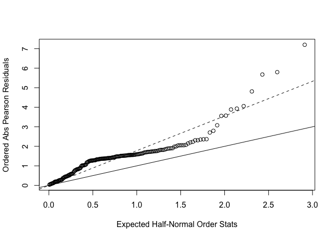

P8131\_hw5\_xy2395
================
Jack Yan
3/5/2019

Problem 1
---------

``` r
crab_df = 
  read.table("./hw5/HW5-crab.txt", header = TRUE) %>% 
  as.tibble()
```

### (a)

M1 : Sa ~ W

``` r
fit1 = glm(Sa ~ W, family = poisson, data = crab_df)

fit1 %>% 
  broom::tidy() %>% 
  mutate(exp_estimate = exp(estimate)) %>% 
  select(-std.error, -statistic, -p.value) %>% 
  knitr::kable()
```

| term        |    estimate|  exp\_estimate|
|:------------|-----------:|--------------:|
| (Intercept) |  -3.3047572|      0.0367081|
| W           |   0.1640451|      1.1782674|

``` r
# Deviance and Pearson statistics are similar
D = sum(residuals(fit1, type = 'deviance')^2); D
```

    ## [1] 567.8786

``` r
G = sum(residuals(fit1, type = 'pearson')^2); G
```

    ## [1] 544.157

``` r
1 - pchisq(G, df = fit1$df.residual) # df = 171
```

    ## [1] 0

The p-value is lower than 0.05, and the deviance from the full model is too large, so the fit is not good.

**Interpretation**: The estimated coefficient of W (carapace width) is 0.164. exp(0.164) = 1.18. This means the number of satellites is estimated to increase 1.18 folds with one-unit increase in carapace width.

### (b)

M2: Sa ~ W + Wt

``` r
fit2 = glm(Sa ~ W + Wt, family = poisson, data = crab_df)

fit2 %>% 
  broom::tidy() %>% 
  mutate(exp_estimate = exp(estimate)) %>% 
  select(term, estimate, exp_estimate, p.value) %>% 
  knitr::kable()
```

| term        |    estimate|  exp\_estimate|    p.value|
|:------------|-----------:|--------------:|----------:|
| (Intercept) |  -1.2916790|       0.274809|  0.1509076|
| W           |   0.0458980|       1.046968|  0.3264035|
| Wt          |   0.4474357|       1.564296|  0.0047949|

``` r
test.stat = fit1$deviance - fit2$deviance
df = fit1$df.residual - fit2$df.residual
1 - pchisq(test.stat, df = df) # df = 1
```

    ## [1] 0.004694838

The p-value is smaller than 0.05, so we reject the null hypothesis and conclude that the larger model (M2) is superior to the smaller model (M1).

### (c)

Check Over Dispersion.

``` r
resid = residuals(fit2, type = 'pearson')
phi = sum(resid^2) / fit2$df.residual
phi
```

    ## [1] 3.156449

``` r
n = fit2$df.null + 1
plot(qnorm((n + 1:n + 0.5)/(2*n + 1.125)), sort(abs(resid)),
     xlab = 'Expected Half-Normal Order Stats',
     ylab = 'Ordered Abs Pearson Residuals')
abline(a = 0, b = 1)
abline(a = 0, b = sqrt(phi), lty = 2)
```



``` r
summary(fit2, dispersion = phi)$coef %>%
  broom::tidy() %>% 
  mutate(exp_estimate = exp(Estimate)) %>% 
  select(.rownames, Estimate, exp_estimate) %>%
  knitr::kable()
```

| .rownames   |    Estimate|  exp\_estimate|
|:------------|-----------:|--------------:|
| (Intercept) |  -1.2916790|       0.274809|
| W           |   0.0458980|       1.046968|
| Wt          |   0.4474357|       1.564296|

As shown in the plot, there is over-dispersion in Model 2.

**Interpretation**: The number of satellites is estimated to increase to 1.05 folds with one-unit increase in female crab's carapace width. The number of satellites is estimated to increase 1.56 folds with one-unit increase in female crab's weight.

Problem 2
---------

``` r
parasite_df = 
  read.table("./hw5/HW5-parasite.txt", header = TRUE) %>% 
  as.tibble() %>% 
  select(Sample, Intensity, Year, Length, Area) %>% 
  janitor::clean_names() %>% 
  mutate(year = as.factor(year),
         area = as.factor(area))
head(parasite_df)
levels(parasite_df$year)
levels(parasite_df$area)
```

### (a)

``` r
fit_fish1 = glm(intensity ~ area + year + length, family = poisson, data = parasite_df)
fit_fish1 %>% 
  broom::tidy() %>% 
  mutate(exp_estimate = exp(estimate)) %>% 
  knitr::kable(digits = 3)
```

| term        |  estimate|  std.error|  statistic|  p.value|  exp\_estimate|
|:------------|---------:|----------:|----------:|--------:|--------------:|
| (Intercept) |     2.643|      0.054|     48.692|    0.000|         14.058|
| area2       |    -0.212|      0.049|     -4.311|    0.000|          0.809|
| area3       |    -0.117|      0.043|     -2.728|    0.006|          0.890|
| area4       |     1.405|      0.036|     39.395|    0.000|          4.075|
| year2000    |     0.670|      0.028|     23.954|    0.000|          1.955|
| year2001    |    -0.218|      0.029|     -7.587|    0.000|          0.804|
| length      |    -0.028|      0.001|    -32.265|    0.000|          0.972|

**Interpretation**

Adjusting for other variables, the number of parasites in Area 2 is estimated to be 0.809 times the number in Area 1. The number of parasites in Area 3 is estimated to be 0.890 times the number in Area 1. The number of parasites in Area 4 is estimated to be 4.075 times the number in Area 1.

Adjusting for other variables, the number of parasites in year 2000 is 1.955 times the number in 1999. The number of parasites in year 2001 is 0.804 times the number in 1999.

The number of parasites changes 0.972 fold with one-unit increase in length of the fish, holding other variables constant.

### (b)

``` r
summary(fit_fish1)
```

    ## 
    ## Call:
    ## glm(formula = intensity ~ area + year + length, family = poisson, 
    ##     data = parasite_df)
    ## 
    ## Deviance Residuals: 
    ##     Min       1Q   Median       3Q      Max  
    ## -9.3632  -2.7158  -2.0142  -0.4731  30.2492  
    ## 
    ## Coefficients:
    ##               Estimate Std. Error z value Pr(>|z|)    
    ## (Intercept)  2.6431709  0.0542838  48.692  < 2e-16 ***
    ## area2       -0.2119557  0.0491691  -4.311 1.63e-05 ***
    ## area3       -0.1168602  0.0428296  -2.728  0.00636 ** 
    ## area4        1.4049366  0.0356625  39.395  < 2e-16 ***
    ## year2000     0.6702801  0.0279823  23.954  < 2e-16 ***
    ## year2001    -0.2181393  0.0287535  -7.587 3.29e-14 ***
    ## length      -0.0284228  0.0008809 -32.265  < 2e-16 ***
    ## ---
    ## Signif. codes:  0 '***' 0.001 '**' 0.01 '*' 0.05 '.' 0.1 ' ' 1
    ## 
    ## (Dispersion parameter for poisson family taken to be 1)
    ## 
    ##     Null deviance: 25797  on 1190  degrees of freedom
    ## Residual deviance: 19153  on 1184  degrees of freedom
    ##   (63 observations deleted due to missingness)
    ## AIC: 21089
    ## 
    ## Number of Fisher Scoring iterations: 7

``` r
G = sum(residuals(fit_fish1, type = 'pearson')^2)
1 - pchisq(G, df = fit_fish1$df.residual)
```

    ## [1] 0

The p-value is smaller than 0.05 and we conclude that the fit is not good.

### (c)

``` r
fit_zip = zeroinfl(intensity ~ area + year + length | area + year + length, data = parasite_df)
```

##### Zero-inflation model coefficients

``` r
summary(fit_zip)$coefficients$zero %>% 
  broom::tidy() %>% 
  mutate(exp_estimate = exp(Estimate)) %>% 
  select(.rownames, Estimate, exp_estimate) %>%
  knitr::kable(digits = 3)
```

    ## Warning: 'tidy.matrix' is deprecated.
    ## See help("Deprecated")

| .rownames   |  Estimate|  exp\_estimate|
|:------------|---------:|--------------:|
| (Intercept) |     0.553|          1.738|
| area2       |     0.719|          2.052|
| area3       |     0.658|          1.930|
| area4       |    -1.023|          0.360|
| year2000    |    -0.752|          0.471|
| year2001    |     0.457|          1.579|
| length      |    -0.010|          0.990|

**Interpretation**

The areas 2 - 4 have different odds of parasite-susceptible fish than Area 1. Area 2 has 2.052 times the odds of susceptible fish than Area 1. Area 3 has 1.93 times the odds of susceptible fish than Area 1. Area 4 has 0.36 times the odds of susceptible fish than Area 1.

The odds of parasite-susceptible fish in 2000 and 2001 differ from that in 1999. The odds of susceptible fish in 2000 is 0.471 times the odds in 1999. The odds of susceptible fish in 2001 is 1.579 times the odds in 1999.

The odds of parasite-susceptiblity changes 0.99 fold with one-unit increase in length of fish. (i.e. The longer the fish, the less susceptible to parasites.

##### Count model coefficients

``` r
summary(fit_zip)$coefficients$count %>% 
  broom::tidy() %>% 
  mutate(exp_estimate = exp(Estimate)) %>% 
  select(.rownames, Estimate, exp_estimate) %>%
  knitr::kable(digits = 3)
```

    ## Warning: 'tidy.matrix' is deprecated.
    ## See help("Deprecated")

| .rownames   |  Estimate|  exp\_estimate|
|:------------|---------:|--------------:|
| (Intercept) |     3.843|         46.673|
| area2       |     0.269|          1.308|
| area3       |     0.146|          1.158|
| area4       |     0.945|          2.572|
| year2000    |     0.392|          1.480|
| year2001    |    -0.045|          0.956|
| length      |    -0.037|          0.964|

**Interpretation**

Adjusting for other variables, the number of parasites in Area 2 is estimated to be 1.308 times the number in Area 1. The number of parasites in Area 3 is estimated to be 1.158 times the number in Area 1. The number of parasites in Area 4 is estimated to be 2.572 times the number in Area 1.

Adjusting for other variables, the number of parasites in year 2000 is 1.480 times the number in 1999. The number of parasites in year 2001 is 0.956 times the number in 1999.

The number of parasites changes 0.964 fold with one-unit increase in length of the fish, holding other variables constant.
