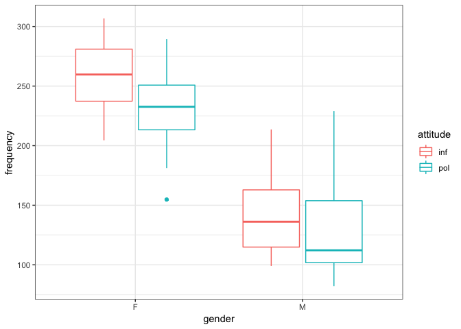

p8131\_hw7\_xy2395
================
Jack Yan
4/11/2019

``` r
# Import data
polite_df <- 
  read_csv('../hw7/HW7-politeness_data.csv') %>%
  as.tibble() %>% janitor::clean_names() 
```

#### 1. Exploratory Analysis

Provide boxplots to show the relation between gender/attitude and pitch.

``` r
# boxplots 
polite_df %>%
  ggplot(aes(x = gender, y = frequency, color = attitude)) +
    geom_boxplot() +
    theme_bw()
```



Males generally tend to have lower pitch than females. Within each gender, informal attitude (inf) tends to have higher pitch than formal attitude (pol).

#### 2. Mixed Effects Model with Random Intercept

Fit a mixed effects model with random intercepts for different subjects (gender and attitude being the fixed effects).

``` r
lmm = lme(frequency ~ gender + attitude, random = ~1 | subject, method = "REML", data = polite_df)

VarCorr(lmm)
```

    ## subject = pdLogChol(1) 
    ##             Variance StdDev  
    ## (Intercept) 598.1953 24.45803
    ## Residual    847.7049 29.11537

``` r
# var(Yi) = 598.1953 + 847.7049 = 1445.9
var = as.numeric(VarCorr(lmm)[[1]]) + as.numeric(VarCorr(lmm)[[2]]); var 
```

    ## [1] 1445.9

``` r
# cov(Yij,Yik) = 598.2
cov = as.numeric(VarCorr(lmm)[[1]]); cov 
```

    ## [1] 598.1953

The covariance matrix for a subject *Y*<sub>*i*</sub> follows a compound symmetry pattern with *v**a**r*(*Y*<sub>*i**j*</sub>)=1445.9 and *c**o**v*(*Y*<sub>*i**j*</sub>, *Y*<sub>*i**k*</sub>)=598.2. There are 14 measurements within each subject, so the covariance matrix is a 14\*14 matrix with *v**a**r*(*Y*<sub>*i**j*</sub>)=1445.9 as diagonal values and *c**o**v*(*Y*<sub>*i**j*</sub>, *Y*<sub>*i**k*</sub>)=598.2 as off-diagonal values.

$var(Y\_{i})=\\begin{bmatrix}  1445.9 & 598.2 & \\dots & 598.2 \\\\  598.2 & 1445.9 & \\\\  \\vdots & &\\ddots & \\vdots\\\\  598.2 & & \\dots & 1445.9  \\end{bmatrix}\_{14 \\times 14}$

``` r
# covariance matrix for the REML estimates of fixed effects
vcov(lmm)
```

    ##             (Intercept)       genderM   attitudepol
    ## (Intercept)   229.67362 -2.195819e+02 -2.018345e+01
    ## genderM      -219.58189  4.391638e+02  6.451438e-15
    ## attitudepol   -20.18345  6.451438e-15  4.036690e+01

The covariance matrix for the REML estimates of fixed effects is shown above.

``` r
# BLUPs for subject-speci􏰍c intercepts
random.effects(lmm)
```

    ##    (Intercept)
    ## F1  -13.575831
    ## F2   10.170522
    ## F3    3.405309
    ## M3   27.960288
    ## M4    4.739325
    ## M7  -32.699613

The BLUPs for subject-specific intercepts are shown above.

``` r
resid_lmm = polite_df$frequency - fitted(lmm)[[1]]
resid_lmm
```

    ##  [1]  -10.108693  -18.908693   61.691307   36.291307  -19.508693
    ##  [6]   63.491307   27.391307   53.391307    8.491307   28.991307
    ## [11]  -42.208693    7.291307   -6.908693  -68.608693    6.291307
    ## [16]   13.891307   13.391307   27.591307   43.591307   42.591307
    ## [21]   51.991307   83.391307    9.191307   29.091307    3.091307
    ## [26]   55.391307   40.991307  -37.908693 -112.708693  -99.808693
    ## [31]    5.591307 -108.508693 -111.208693   -9.808693  -30.008693
    ## [36]  -60.508693 -121.608693  -96.508693 -113.408693  -87.208693
    ## [41]  -77.408693  -96.908693 -137.308693 -124.308693 -141.208693
    ## [46] -119.108693 -137.508693 -113.208693 -126.308693 -103.408693
    ## [51] -129.708693 -120.508693 -114.608693 -115.208693  -99.008693
    ## [56] -115.808693    9.291307    7.891307   22.891307   36.291307
    ## [61]   65.991307   78.391307   19.791307   72.791307   54.291307
    ## [66]   70.791307  -15.408693    2.491307   57.591307    3.791307
    ## [71]  -69.608693  -34.608693  -81.008693  -23.708693  -63.208693
    ## [76]  -37.308693  -15.908693  -32.508693  -62.708693  -66.908693
    ## [81]  -76.708693  -65.408693  -62.308693  -70.108693

Residuals are the deviations from subject-specific mean. The residuals are shown above.

#### 3. Likelihood Ratio Test for the Interaction Term

Fit a mixed effects model with intercepts for different subjects (gender, attitude and their interaction being the fixed effects).

``` r
lmm_small = lme(frequency ~ gender + attitude, random = ~1 | subject, method = "ML", data = polite_df)
lmm_large = lme(frequency ~ gender * attitude, random = ~1 | subject, method = "ML", data = polite_df)

anova(lmm_small, lmm_large)
```

    ##           Model df      AIC      BIC    logLik   Test  L.Ratio p-value
    ## lmm_small     1  5 825.6363 837.7904 -407.8182                        
    ## lmm_large     2  6 826.2508 840.8357 -407.1254 1 vs 2 1.385523  0.2392

We use maximum likelihood method to fit the model. The p-value for Likelihood ratio test is 0.2392 &gt; 0.05, so we fail to reject the null and conclude that the interaction term is not significantly associated with pitch, at the significance level of 0.05.

#### 4. Mixed Effects Model with Random Intercept and Slope

Model: *Y*<sub>*i**j*</sub> = *β*<sub>1</sub> + *β*<sub>2</sub> \* *g**e**n**d**e**r* + *β*<sub>3</sub> \* *I*(*a**t**t**i**t**u**d**e* = *p**o**l*)+*b*<sub>1*i*</sub> + *b*<sub>2*i*</sub> \* *I*(*a**t**t**i**t**u**d**e* = *p**o**l*)+*ϵ*<sub>*i**j*</sub>,

where *β*<sub>1</sub> and *β*<sub>2</sub> are fixed intercept and slope, respectively, and *b*<sub>1*i*</sub> and *b*<sub>2*i*</sub> are random intercept and slope, respectively.

``` r
lmm2 = lme(frequency ~ gender + attitude, random = ~1 + attitude | subject, method = "REML", data = polite_df)

VarCorr(lmm2)
```

    ## subject = pdLogChol(1 + attitude) 
    ##             Variance     StdDev       Corr  
    ## (Intercept) 5.981953e+02 24.458032213 (Intr)
    ## attitudepol 1.079496e-05  0.003285569 0     
    ## Residual    8.477049e+02 29.115372269

``` r
getVarCov(lmm2)
```

    ## Random effects variance covariance matrix
    ##             (Intercept) attitudepol
    ## (Intercept)  5.9820e+02  1.3002e-05
    ## attitudepol  1.3002e-05  1.0795e-05
    ##   Standard Deviations: 24.458 0.0032856

We get *g*<sub>11</sub> = 598.2, *g*<sub>22</sub> = 1.079496 \* 10<sup>−5</sup>, *g*<sub>12</sub> = 0, and *σ*<sup>2</sup> = 847.7.

Variance: *v**a**r*(*Y*<sub>*i**j*</sub>)=*g*<sub>11</sub> + 2*t*<sub>*i**j*</sub>*g*<sub>12</sub> + *t*<sub>*i**j*</sub><sup>2</sup>*g*<sub>22</sub> + *σ*<sup>2</sup>

1.  If *t*<sub>*i**j*</sub> = 1, *v**a**r*(*Y*<sub>*i**j*</sub>)=*g*<sub>11</sub> + 2*t*<sub>*i**j*</sub>*g*<sub>12</sub> + *t*<sub>*i**j*</sub><sup>2</sup>*g*<sub>22</sub> + *σ*<sup>2</sup> = 598.2 + 2 \* 0 + 1.079496 \* 10<sup>−5</sup> + 847.7 = 1445.9

2.  If *t*<sub>*i**j*</sub> = 0, *v**a**r*(*Y*<sub>*i**j*</sub>)=*g*<sub>11</sub> + *σ*<sup>2</sup> = 598.2 + 847.7 = 1445.9

The general formula of covariance between *Y*<sub>*i**j*</sub> and *Y*<sub>*i**k*</sub> is

*c**o**v*(*Y*<sub>*i**j*</sub>, *Y*<sub>*i**k*</sub>)=*g*<sub>11</sub> + (*t*<sub>*i**j*</sub> + *t*<sub>*i**k*</sub>)*g*<sub>12</sub> + *t*<sub>*i**j*</sub>*t*<sub>*i**k*</sub>*g*<sub>22</sub>.

1.  If *t*<sub>*i**j*</sub> = 0 and *t*<sub>*i**k*</sub> = 0, *c**o**v*(*Y*<sub>*i**j*</sub>, *Y*<sub>*i**k*</sub>)=*g*<sub>11</sub> = 598.2.

2.  If *t*<sub>*i**j*</sub> = 0 and *t*<sub>*i**k*</sub> = 1, *c**o**v*(*Y*<sub>*i**j*</sub>, *Y*<sub>*i**k*</sub>)=*g*<sub>11</sub> + *g*<sub>12</sub> = 598.2 + 0 = 598.2.

3.  If *t*<sub>*i**j*</sub> = 1 and *t*<sub>*i**k*</sub> = 0, *c**o**v*(*Y*<sub>*i**j*</sub>, *Y*<sub>*i**k*</sub>)=*g*<sub>11</sub> + *g*<sub>12</sub> = 598.2 + 1.079496 \* 10<sup>−5</sup> = 598.2.

4.  If *t*<sub>*i**j*</sub> = 1 and *t*<sub>*i**k*</sub> = 1, *c**o**v*(*Y*<sub>*i**j*</sub>, *Y*<sub>*i**k*</sub>)=*g*<sub>11</sub> + 2*g*<sub>12</sub> + *g*<sub>22</sub> = 598.2 + 2 \* 0 + 1.079496 \* 10<sup>−5</sup> = 598.2.

Since *g*<sub>22</sub> is small and *t*<sub>*i**j*</sub> can be either 0 or 1, we ignore the terms *t*<sub>*i**j*</sub><sup>2</sup>*g*<sub>22</sub> and *t*<sub>*i**j*</sub>*t*<sub>*i**k*</sub>*g*<sub>22</sub>.

So we get *v**a**r*(*Y*<sub>*i**j*</sub>)=1445.9 and *c**o**v*(*Y*<sub>*i**j*</sub>, *Y*<sub>*i**k*</sub>)=598.2 for any different j and k.

The random slope has small variance, thus captures little variation in the data. So this model does not do much better job than a random intercept model. The covariance structure for this model is thus numerically a compound symmetry structure as in Question 2.

``` r
fixed.effects(lmm2)
```

    ## (Intercept)     genderM attitudepol 
    ##   256.98691  -108.79762   -20.00238

``` r
fixed_effect = 256.98691 + -20.00238; fixed_effect
```

    ## [1] 236.9845

``` r
random.effects(lmm2)
```

    ##    (Intercept)   attitudepol
    ## F1  -13.575831 -8.408891e-07
    ## F2   10.170522  1.499413e-07
    ## F3    3.405308 -2.981919e-07
    ## M3   27.960288  1.009764e-06
    ## M4    4.739325  7.794162e-07
    ## M7  -32.699612 -8.000404e-07

``` r
random_effect = -13.575831 + -8.408891 * 10^(-07); random_effect
```

    ## [1] -13.57583

``` r
BLUP = fixed_effect + random_effect; BLUP
```

    ## [1] 223.4087

#### 5.

``` r
library(lme4)
```

    ## Loading required package: Matrix

    ## 
    ## Attaching package: 'Matrix'

    ## The following object is masked from 'package:tidyr':
    ## 
    ##     expand

    ## 
    ## Attaching package: 'lme4'

    ## The following object is masked from 'package:nlme':
    ## 
    ##     lmList

``` r
lmm3 = lmer(frequency ~ gender + attitude + (1 | subject) +  (1 | scenario), data = polite_df)
summary(lmm3)
```

    ## Linear mixed model fit by REML ['lmerMod']
    ## Formula: frequency ~ gender + attitude + (1 | subject) + (1 | scenario)
    ##    Data: polite_df
    ## 
    ## REML criterion at convergence: 784.1
    ## 
    ## Scaled residuals: 
    ##     Min      1Q  Median      3Q     Max 
    ## -2.2690 -0.6331 -0.0878  0.5204  3.5326 
    ## 
    ## Random effects:
    ##  Groups   Name        Variance Std.Dev.
    ##  scenario (Intercept) 224.5    14.98   
    ##  subject  (Intercept) 613.2    24.76   
    ##  Residual             637.8    25.25   
    ## Number of obs: 84, groups:  scenario, 7; subject, 6
    ## 
    ## Fixed effects:
    ##             Estimate Std. Error t value
    ## (Intercept)  256.987     16.101  15.961
    ## genderM     -108.798     20.956  -5.192
    ## attitudepol  -20.002      5.511  -3.630
    ## 
    ## Correlation of Fixed Effects:
    ##             (Intr) gendrM
    ## genderM     -0.651       
    ## attitudepol -0.171  0.000
