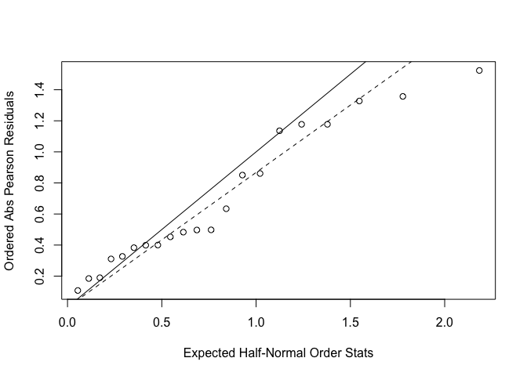

p8131\_hw3\_xy2395
================
Jack Yan
2/19/2019

#### Problem 1

##### Data entry

Manually import the data.

``` r
case <- tibble(
  age = c(25, 35, 45, 55, 65, 75),
  non_exposed = c(0, 5, 21, 34, 36, 8),
  exposed = c(1, 4, 25, 42, 19, 5)
) %>% 
  mutate(disease = 'diseased')

control <- tibble(
  age = c(25, 35, 45, 55, 65, 75),
  non_exposed = c(106, 164, 138, 139, 88, 31),
  exposed = c(9, 26, 29, 27, 18, 0)
) %>% 
  mutate(disease = 'non_diseased')
```

##### Data manipulation

Make the data suitable for prospective modeling.

``` r
data_p1 = 
  rbind(case, control) %>%
  gather(key = 'exposure_status', value = 'number', non_exposed:exposed) %>% 
  mutate(exposure_status = recode(exposure_status, non_exposed = '0', exposed = '1')) %>% 
  mutate(exposure_status = as.factor(exposure_status)) %>% 
  spread(key = disease, value = number) %>% 
  mutate(m = diseased + non_diseased) %>% 
  select(diseased, m, exposure_status, age)

data_p1
```

    ## # A tibble: 12 x 4
    ##    diseased     m exposure_status   age
    ##       <dbl> <dbl> <fct>           <dbl>
    ##  1        0   106 0                  25
    ##  2        1    10 1                  25
    ##  3        5   169 0                  35
    ##  4        4    30 1                  35
    ##  5       21   159 0                  45
    ##  6       25    54 1                  45
    ##  7       34   173 0                  55
    ##  8       42    69 1                  55
    ##  9       36   124 0                  65
    ## 10       19    37 1                  65
    ## 11        8    39 0                  75
    ## 12        5     5 1                  75

##### Model fitting

``` r
fit = glm(cbind(diseased, m) ~ exposure_status + age, family = binomial(link = 'logit'), data_p1)
summary(fit)
```

    ## 
    ## Call:
    ## glm(formula = cbind(diseased, m) ~ exposure_status + age, family = binomial(link = "logit"), 
    ##     data = data_p1)
    ## 
    ## Deviance Residuals: 
    ##     Min       1Q   Median       3Q      Max  
    ## -2.8154  -1.7938  -0.3550   0.8536   1.4054  
    ## 
    ## Coefficients:
    ##                   Estimate Std. Error z value Pr(>|z|)    
    ## (Intercept)      -4.450206   0.388849 -11.445  < 2e-16 ***
    ## exposure_status1  1.203536   0.166305   7.237 4.59e-13 ***
    ## age               0.047303   0.006794   6.963 3.34e-12 ***
    ## ---
    ## Signif. codes:  0 '***' 0.001 '**' 0.01 '*' 0.05 '.' 0.1 ' ' 1
    ## 
    ## (Dispersion parameter for binomial family taken to be 1)
    ## 
    ##     Null deviance: 135.878  on 11  degrees of freedom
    ## Residual deviance:  24.837  on  9  degrees of freedom
    ## AIC: 75.187
    ## 
    ## Number of Fisher Scoring iterations: 4

``` r
fit %>% broom::tidy() %>% knitr::kable()
```

| term              |    estimate|  std.error|   statistic|  p.value|
|:------------------|-----------:|----------:|-----------:|--------:|
| (Intercept)       |  -4.4502062|  0.3888486|  -11.444572|        0|
| exposure\_status1 |   1.2035359|  0.1663047|    7.236932|        0|
| age               |   0.0473034|  0.0067939|    6.962619|        0|

``` r
# pval = 1 - pchisq(fit$deviance, 9); pval
```

##### Interpretation

The intercept is not interpretable. The log odds ratio of esophageal cancer for low versus high daily alcohol consumption is 1.20, holding age constant. The log odds ratio of esophageal cancer for one-year increase in age is 0.05, holding exposure status constant.

##### Hypothesis test

Model 0: (dieseased, m) ~ age

Model 1: (diseased, m) ~ age + alcohol\_exposure

``` r
fit_0 = glm(cbind(diseased, m) ~ age, family = binomial(link = 'logit'), data_p1)

G0 = sum(residuals(fit, type = 'pearson')^2) # pearson chisq 
phi = G0 / 9

test_statistic = (fit_0$deviance - fit$deviance) / phi
test_statistic
```

    ## [1] 22.86451

``` r
1 - pf(test_statistic, 1, 9)
```

    ## [1] 0.0009989219

The p-value for F test is less than 0.05. We reject the null and conclude that Model 1 with age and alcohol consumption as predictors is the superior model.

#### Problem 2

##### Data entry

``` r
  y_bean_75 = c(10, 23, 23, 26, 17)
  m_bean_75 = c(39, 62, 81, 51, 39)
  y_bean_73 = c(8, 10, 8, 23, 0)
  m_bean_73 = c(16, 30, 28, 45, 4)

  y_cucb_75 = c(5, 53, 55, 32, 46, 10)
  m_cucb_75 = c(6, 74, 72, 51, 79, 13)
  y_cucb_73 = c(3, 22, 15, 32, 3)
  m_cucb_73 = c(12, 41, 30, 51, 7)
  

bean = tibble(
    y = c(y_bean_75, y_bean_73),
    m = c(m_bean_75, m_bean_73),
    extract = 'bean',
    seed = c(rep('75', length(y_bean_75)), rep('73', length(y_bean_73)))
) 

cucumber = tibble(
    y = c(y_cucb_75, y_cucb_73),
    m = c(m_cucb_75, m_cucb_73),
    extract = 'cucumber',
    seed = c(rep('75', length(y_cucb_75)), rep('73', length(y_cucb_73))) 
    )

data_p2 = rbind(bean, cucumber)
```

##### Model fitting

``` r
fit_glm = glm(cbind(y, m) ~ seed + extract, family = binomial(link = 'logit'), data_p2)

summary(fit_glm)
```

    ## 
    ## Call:
    ## glm(formula = cbind(y, m) ~ seed + extract, family = binomial(link = "logit"), 
    ##     data = data_p2)
    ## 
    ## Deviance Residuals: 
    ##     Min       1Q   Median       3Q      Max  
    ## -1.5431  -0.5006  -0.1852   0.3968   1.4796  
    ## 
    ## Coefficients:
    ##                 Estimate Std. Error z value Pr(>|z|)    
    ## (Intercept)      -1.0594     0.1326  -7.989 1.37e-15 ***
    ## seed75            0.1128     0.1311   0.860     0.39    
    ## extractcucumber   0.5232     0.1233   4.242 2.22e-05 ***
    ## ---
    ## Signif. codes:  0 '***' 0.001 '**' 0.01 '*' 0.05 '.' 0.1 ' ' 1
    ## 
    ## (Dispersion parameter for binomial family taken to be 1)
    ## 
    ##     Null deviance: 33.870  on 20  degrees of freedom
    ## Residual deviance: 14.678  on 18  degrees of freedom
    ## AIC: 104.65
    ## 
    ## Number of Fisher Scoring iterations: 4

##### Interpretation

The odds ratio of germination for O. aegyptiaca 75 versus O. aegyptiaca 73 is 0.1128, holding the type of root extract constant. The odds ratio of germination for cucumber root extract versus bean root extract is 0.5232, holding the type of seed constant. The intercept -1.0594 is the odds of germination for O. aegyptiaca 73 on bean root extract.

##### Overdispersion

``` r
pval = 1 - pchisq(fit_glm$deviance, 21 - 2)
pval # fit is good
```

    ## [1] 0.7428147

``` r
G.stat = sum(residuals(fit_glm, type = 'pearson')^2) # pearson chisq 
G.stat
```

    ## [1] 13.54026

``` r
phi = G.stat / 18
phi
```

    ## [1] 0.7522366

``` r
tilde.phi = fit_glm$deviance / fit_glm$df.residual
tilde.phi
```

    ## [1] 0.8154595

``` r
res = residuals(fit_glm, type = 'pearson')
plot(qnorm((21+1:21+0.5)/(2*21+1.125)),sort(abs(res)),xlab='Expected Half-Normal Order Stats',ylab='Ordered Abs Pearson Residuals')
abline(a=0,b=1)
abline(a=0, b=sqrt(phi), lty = 2)
```



There is no overdispersion.
